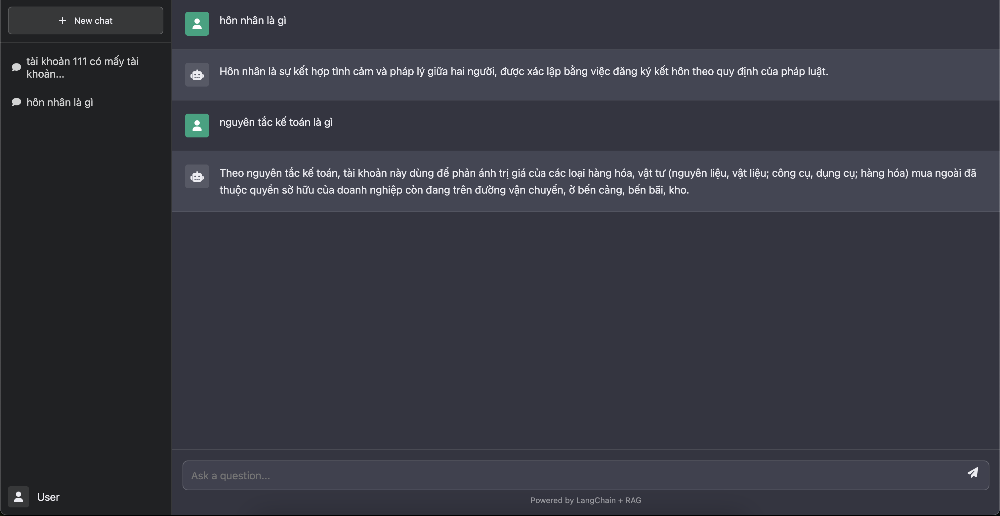

# RAG Document Assistant

A ChatGPT-like interface for document retrieval-augmented generation (RAG) using LangChain, FastAPI, and modern web technologies.

## Features

- Beautiful, responsive UI similar to ChatGPT
- Document-based question answering
- Chat history saving
- Multiple retrieval methods (Vector DB, BM25, TF-IDF)
- Document reranking for improved accuracy

## Demo



## Getting Started

### Requirements

Make sure you have all the required dependencies installed:

```bash
pip install -r requirements.txt
```

### Running the Application

1. Place your PDF documents in the `docs/` directory
2. Start the FastAPI server:

```bash
uvicorn app:app --reload
```

3. Visit http://localhost:8000 in your browser to access the chat interface

## API Documentation

The application exposes the following endpoints:

- `/` - Redirects to the chat interface
- `/check` - Health check endpoint
- `/generative_ai` - Main endpoint for querying the RAG system
- `/docs` - Swagger documentation for the API

## Tech Stack

- **Backend**: FastAPI, LangChain
- **Frontend**: HTML, CSS, JavaScript
- **Embedding Models**: HuggingFace, HaLong Embedding
- **Vector Databases**: FAISS, Chroma
- **Additional Retrievers**: BM25, TF-IDF
- **Document Reranking**: PhoRanker, custom models

## Project Structure

- `app.py` - Main FastAPI application
- `static/` - Frontend files (HTML, CSS, JS)
- `src/` - Backend modules
  - `rag_module/` - RAG implementation
  - `base/` - Base models and utilities
- `docs/` - Documents for RAG system 